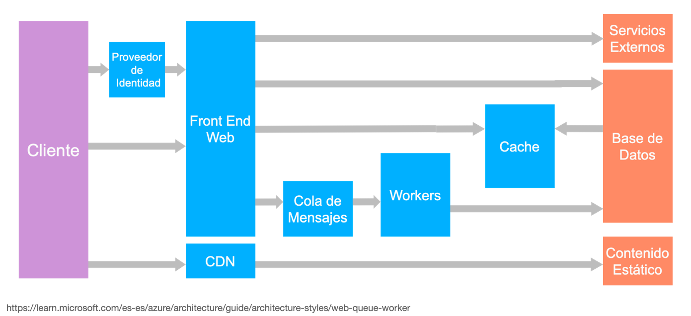

# ImageService

## Descripción General

### Proyecto: Servicio de Procesamiento de Imágenes

En este proyecto vamos a desarrollar una aplicación web donde los usuarios
van a subir imágenes para ser procesadas. El procesamiento puede variar desde
cambiar el tamaño, aplicar filtros, o incluso ejecutar un modelo simple de
aprendizaje automático para clasificar o modificar la imagen.

El proyecto sigue una arquitectura guiada por eventos como las vistas en clase:

**Componentes:**
1. **Frontend Web:**
   - Una interfaz sencilla donde los usuarios puedan subir imágenes.
   - Para esto utilizaremos plantillas de django y programación de lado del cliente.
   - Mostrar un estado (por ejemplo, "procesando", "listo", "error") del trabajo de procesamiento de imágenes.

2. **Servidor Backend:**
Podemos utilizar también django pero de manera alternativa para tu proyecto se puedes utilizar nodejs, express,  Flask u otro servidor backend.
   - Maneja solicitudes HTTP del frontend para la carga de imágenes.
   - Coloca tareas de procesamiento de imágenes en una cola de mensajes.

3. **Cola de Mensajes:**
   - Utilizar un sistema de cola de mensajes como RabbitMQ o AWS SQS, en el proyecto a desarrollar en clase utilizaremos Redis.
   - La cola contiene las tareas que están esperando ser procesadas.
   

4. **Servicio de Trabajadores:**
   - Varias instancias de trabajadores que escuchan la cola.
   - Cuando una tarea está disponible, un trabajador la toma, procesa la imagen y luego actualiza el estado de la tarea.
   - Los trabajadores funcionan independientemente del servidor web, lo que permite escalabilidad y utilización eficiente de recursos.

5. **Base de Datos:**
   - Para rastrear el estado y los metadatos de cada tarea de procesamiento de imágenes.
   - Se podría usar PostgreSQL o algún almacén de datos NoSQL.

**Resultados de Aprendizaje:**
- Comprensión de cómo las colas de mensajes facilitan el procesamiento asíncrono en aplicaciones web.
- Experiencia en la escalabilidad de trabajadores basada en la carga.
- Perspectiva sobre el manejo de tareas de larga duración en una aplicación web sin bloquear las solicitudes de los usuarios.
- Práctica en la integración de diferentes componentes (frontend, backend, base de datos, cola de mensajes, trabajadores) en una aplicación completa.

**Extensiones:**
- Implementar diferentes tipos de procesamiento de imágenes para ver cómo se pueden gestionar distintas tareas.
- Añadir una función para que los usuarios reciban notificaciones (por ejemplo, a través de correo electrónico o una notificación push web) una vez que su procesamiento de imágenes esté completo.
- Incluir registro y monitoreo para observar el comportamiento del sistema bajo carga.

## Requerimientos Técnicos

Para este proyecto haremos un uso más completo de la plataforma Cloud de Amazon Web Services utilizando los siguientes componentes:

S3 Utilizaremos este servicio para almacenar las imágenes y otro contenido
ECR Es necesario tener repositorios para almacenar las distintas versiones de las imágenes Docker que utilizaremos.
ECS Utilizaremos el servicio Fargate pare ejecutar tareas y servicios.
Cloud9 Por restricciones de uso del servicio de AWS académico será más fácil desarrollar el proyecto utilizando el IDE de Amazon.
Lambda Otra alternativa es utilizar funciones *serverless*.

Para el proyecto puedes investigar otras tecnologías adicionales.

